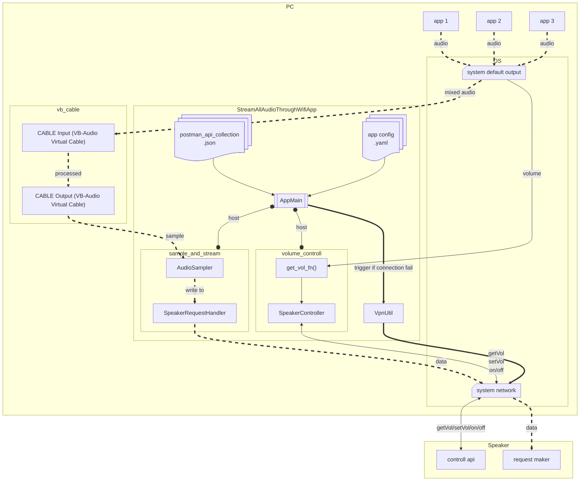

# StreamAllAudioThroughWifi

## Overview

`StreamAllAudioThroughWifi` is a Windows-only helper for streaming PC audio through a DLNA/UPnP speaker over WiFi.
It captures audio from a virtual cable device, serves it as a live WAV stream, then pushes that stream to a network speaker while syncing the speaker volume with the Windows master volume.

## Features

- Live audio capture from `VB-Audio Virtual Cable`
- HTTP WAV streaming to DLNA/UPnP speakers
- Automatic speaker discovery by name regex
- Speaker power / volume control via Postman collection
- Optional VPN toggling on failure to improve local discovery/connectivity
- One-click Windows setup and launch scripts

## Getting Started

### Prerequisites

- Windows 10 / 11
- Python 3.10+ installed
- Administrator rights for VB-Cable installation
- The speaker must support DLNA/UPnP and expose AVTransport control

### Setup

1. Open `setUp.bat` by double-clicking it.
2. The script will:
   - create a local virtual environment in `.venv`
   - install dependencies from `requirements.txt`
   - download and run the VB-Cable installer via `install_vbcable.py`
3. If the VB-Cable installer prompts for admin permission, allow it.

> If setup fails, make sure Python is installed and `setUp.bat` is run from inside the project folder.

### Run

1. After setup completes, double-click `runWifiMusic.bat`.
2. The launcher activates the virtual environment and starts `main.py` with high process priority.
3. The app will:
   - start an HTTP audio stream on port `8000`
   - discover matching DLNA speakers on the LAN
   - bind Windows master volume changes to speaker volume
   - keep running until you press `Ctrl+C` in the console or close the window

## Configuration

### Default config file

The app loads `./configs/kef-lsx ii.yaml` by default from `main.py`.
Update this YAML file to match your environment.

### Key sections

- `SAMPLING`
  - `RATE`: audio sample rate (default `96000`)
  - `WIDTH`: sample width in bytes (`3` means 24-bit PCM)
  - `CHANNELS`: number of channels
  - `FRAMES_PER_BUFFER`: buffer size for capture
  - `REQUIRED_SYSTEM_OUTPUT`: Windows playback device that should be selected as the system default output
  - `SOURCE_REGEX`: regex used to resolve the virtual audio input device

- `STREAM`
  - `PORT`: HTTP port used by the live audio stream

- `SPEAKER`
  - `NAME_REGEX`: regex used to match the target speaker friendly name
  - `COMMAND.POSTMAN_COLLECTION`: Postman JSON file used to send speaker control requests
  - `COMMAND.POWER`: speaker power-on/off command sequences
  - `COMMAND.VOLUME`: speaker get/set volume sequences

- `VPN`
  - `TOGGLE_IF_FAILED`: if `true`, the app will temporarily disable VPN and retry when discovery or playback fails
  - `COMMAND.DOWN` / `COMMAND.UP`: shell commands used to toggle VPN

## Architecture

The main workflow is:

1. Load YAML config
2. Start `SpeakerRequestHandler` HTTP streaming server
3. Discover DLNA/UPnP speakers using `upnpclient`
4. Select the matched speaker
5. Use the speaker's Postman API collection to power on the device and control volume
6. Continuously read Windows master volume and push updates to the speaker



### Important components

- `main.py`: orchestrates startup, discovery, streaming, and cleanup
- `speaker_request_handler.py`: captures audio from the virtual cable and serves a continuous WAV stream
- `speaker_controller.py`: executes speaker control requests using a Postman collection
- `app_config.py`: loads YAML config while preserving `on/off` strings as strings
- `function_utils.py`: reads Windows master volume and provides helper utilities
- `vpn_utils.py`: toggles VPN when needed
- `install_vbcable.py`: downloads and runs the VB-Cable installer

## Dependencies

Managed by `requirements.txt`:

- `PyYAML` – YAML config parsing
- `numpy` – audio sample conversion
- `SoundCard` – Windows audio capture
- `upnpclient` – DLNA/UPnP discovery
- `python-postman[execution]` – execute Postman requests
- `comtypes`, `pycaw` – Windows audio volume control

## Troubleshooting

- If audio stream cannot start, confirm `VB-Audio Virtual Cable` is installed and the Windows default output is set to `CABLE Input (VB-Audio Virtual Cable)`.
- If speaker discovery fails, verify `SPEAKER.NAME_REGEX` matches the speaker name returned by UPnP discovery.
- If `VPN.TOGGLE_IF_FAILED` is enabled, ensure the `COMMAND.DOWN` / `COMMAND.UP` commands work in your environment.
- If `speaker_api/KEF-LSX II.postman_collection.json` does not match your speaker API, update it or provide a compatible collection and YAML command mapping.

## Manual commands

From the project root:

```powershell
.venv\Scripts\activate.bat
python -m pip install -r requirements.txt
python install_vbcable.py
python main.py
```

## Tests

Run the included unit tests with:

```powershell
python -m unittest tests/test_audio_request_handler.py
```

## Notes

- This project is designed for Windows and assumes the speaker is controllable via HTTP API/UPnP.
- The app currently uses a hard-coded default config file `configs/kef-lsx ii.yaml`.
- Customize `configs/*.yaml` and `speaker_api/*.postman_collection.json` to support other speaker models.
